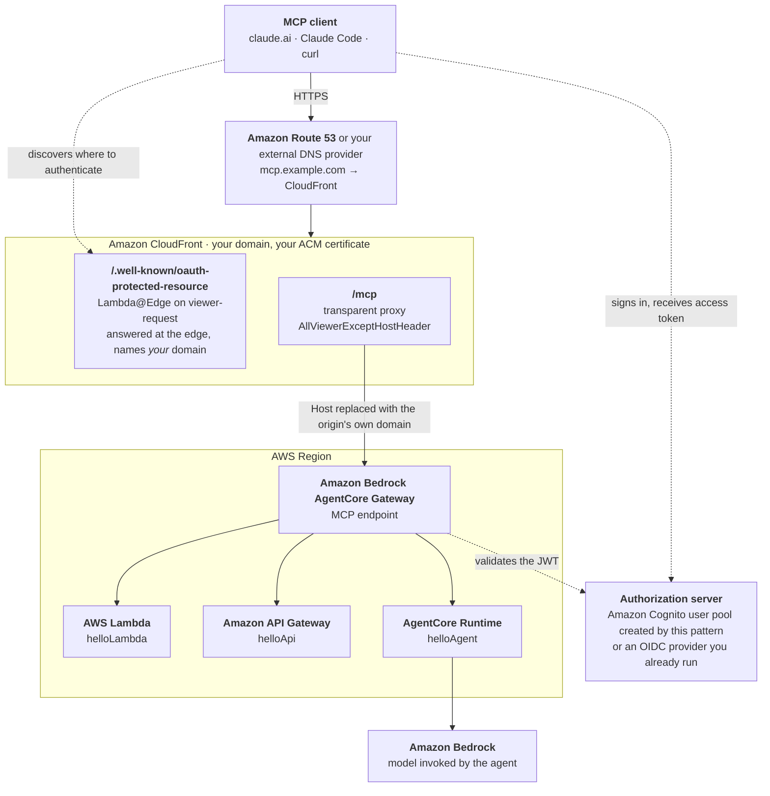

# Amazon CloudFront to Amazon Bedrock AgentCore Gateway

Put your own custom domain in front of an Amazon Bedrock AgentCore Gateway, with
OAuth 2.0 authorization.

An AgentCore Gateway serves MCP on an AWS-assigned regional hostname such as
`abc123.gateway.bedrock-agentcore.us-east-1.amazonaws.com`, and that hostname
cannot carry a custom domain. This pattern places CloudFront in front of it so
clients connect to a name you own, with your own certificate, and never see an
AWS-assigned hostname in their configuration.

Learn more about this pattern at
[Serverless Land Patterns](https://serverlessland.com/patterns/cloudfront-agentcore-gateway-terraform).

Important: this application uses various AWS services and there are costs
associated with these services after the Free Tier usage — please see the
[AWS Pricing page](https://aws.amazon.com/pricing/) for details. You are
responsible for any AWS costs incurred. No warranty is implied in this example.

## Requirements

- An [AWS account](https://portal.aws.amazon.com/gp/aws/developer/registration/index.html)
- [AWS CLI](https://docs.aws.amazon.com/cli/latest/userguide/install-cliv2.html) installed and configured
- [Terraform](https://developer.hashicorp.com/terraform/downloads) 1.5 or later
- [Git](https://git-scm.com/book/en/v2/Getting-Started-Installing-Git)
- A **subdomain** you can create DNS records for, such as `mcp.example.com`
- Amazon Bedrock AgentCore Gateway available in your chosen region
- [uv](https://docs.astral.sh/uv/getting-started/installation/), to build the agent's
  deployment package
- Amazon Bedrock model access for the inference profile named by `agent_model_id`

The last two are for the AgentCore Runtime agent, which is one of the three tool
targets and is deployed by default. If you cannot get model access or cannot install
`uv`, set `agent_enabled = false` and you still get the front door with its Lambda
and API Gateway targets. See [the agent target](#the-agentcore-runtime-agent).

## How it works



Three tool targets, all deployed, so a real MCP client pointed at your domain can
call a plain function, a REST API, and an agent that reasons with a model.

The two paths through CloudFront do different jobs. `/mcp` is a transparent proxy to
the Gateway. `/.well-known/oauth-protected-resource` never reaches the origin at all —
the edge function answers it, and the next two sections explain why both of those
choices are load-bearing.

Two things make this work that are not obvious, and both are the reason this
pattern exists.

### The Host header

The Gateway derives its own identity from the **first label of the HTTP Host
header**. Forward the viewer's Host and it receives a name identifying CloudFront,
which it rejects with `400 Invalid GatewayId`.

The managed `AllViewerExceptHostHeader` origin request policy solves this. AWS
documents that when the viewer's Host header is removed, CloudFront
[substitutes the origin's own domain name](https://docs.aws.amazon.com/AmazonCloudFront/latest/DeveloperGuide/origin-request-understand-origin-request-policy.html).
That is exactly what the Gateway needs, and it is why a single-region front door
needs no routing function at all.

### The protected-resource document

An MCP client that gets a `401` fetches an
[RFC 9728](https://datatracker.ietf.org/doc/html/rfc9728) protected-resource
document to learn where to authenticate. Proxied straight through, the Gateway
returns **its own** document:

```json
{ "resource": "https://abc123.gateway.bedrock-agentcore.us-east-1.amazonaws.com/mcp" }
```

A compliant client compares that identifier against the server it actually
connected to, sees a mismatch, and stops — with no login prompt and no useful
error. Tests that use a pre-obtained bearer token still pass, which is what makes
this failure easy to miss.

So a Lambda@Edge function generates the document at the edge instead, naming your
domain. It reads the hostname from the viewer's `Host` header rather than having it
templated in, so the same code works on the CloudFront name and on your domain with
no change.

## Deployment

```bash
git clone https://github.com/aws-samples/serverless-patterns
cd serverless-patterns/cloudfront-agentcore-gateway-terraform
cp terraform.tfvars.example terraform.tfvars
```

### First, build the agent's package

Required before Terraform runs, whichever option you pick below. Needs
[uv](https://docs.astral.sh/uv/getting-started/installation/).

```bash
./agent/build.sh
```

Produces `agent/dist/agent.zip`, roughly 27 MB. This is a separate step rather than
part of the apply because Terraform reads the artifact's hash at **plan** time, so
the file has to exist before Terraform starts — a provisioner would run during apply,
too late. If you skip it, the plan stops with a message telling you to run this.

Skip it only if you set `agent_enabled = false`.

### Then choose an option

Edit `terraform.tfvars`. Two choices only: **where your DNS lives**, and **who
issues tokens**. That gives four combinations, ordered below from everything already
in AWS to nothing in AWS.

| | DNS | Tokens | Applies | You paste records by hand |
|---|---|---|---|---|
| **Option 1** | Route 53 | Cognito (created for you) | 1 | no |
| **Option 2** | Route 53 | your own provider | 1 | no |
| **Option 3** | external | Cognito (created for you) | 2 | yes |
| **Option 4** | external | your own provider | 2 | yes |

`custom_domain` is required in all four. Everything else has a working default,
including the agent.

### Option 1 — Route 53 + Cognito · everything in AWS

Terraform creates everything: the Cognito user pool, the certificate, and both DNS
records. One apply, nothing to paste by hand.

**Step 1 — apply**

```hcl
custom_domain   = "mcp.example.com"
route53_zone_id = "Z0123456789ABCDEFGHIJ"
```

```bash
terraform init
terraform apply
```

The zone must be in the **same AWS account** you are deploying to. A zone in another
account is Option 3.

**Step 2 — create a user and test**

Terraform creates the pool but no users, so you add one. See
[Obtaining a token](#obtaining-a-token).

```bash
export TOKEN=$(./test/create-user.sh testuser '<your-password>' --token-only)
./test/smoke.sh
```

### Option 2 — Route 53 + your own identity provider · DNS in AWS, auth outside

Terraform creates the certificate and both DNS records, and no user pool. One apply,
nothing to paste by hand.

**Step 1 — apply**

```hcl
custom_domain   = "mcp.example.com"
route53_zone_id = "Z0123456789ABCDEFGHIJ"

auth_mode             = "external"
oidc_discovery_url    = "https://dev-12345.okta.com/oauth2/default/.well-known/openid-configuration"
oidc_allowed_audience = ["api://default"]
```

Set `oidc_allowed_audience` for Okta, Entra or Auth0, whose tokens carry a real `aud`
claim. Use `oidc_allowed_clients` instead for a provider whose access tokens carry
`client_id` and no `aud`. One or the other, never both.

```bash
terraform init
terraform apply
```

**Step 2 — get a token from your own provider and test**

```bash
export TOKEN='<token from your provider>'
./test/smoke.sh
```

### Option 3 — External DNS + Cognito · auth in AWS, DNS outside

Your domain stays at GoDaddy, Namecheap, Cloudflare, or anywhere else. Terraform
creates the Cognito pool but no DNS records.

Two applies, because ACM needs a validation record to exist before it issues a
certificate, and CloudFront will not accept an alternate domain name until that
certificate is issued. With DNS outside Terraform's control, you sit in the middle
of that chain.

**Step 1 — first apply, on the CloudFront name**

```hcl
custom_domain          = "mcp.example.com"
route53_zone_id        = ""
external_dns_validated = false
```

```bash
terraform init
terraform apply
```

This already gives you a **working MCP endpoint** on the CloudFront name, so you can
test the whole path before touching DNS:

```bash
terraform output cloudfront_url
```

**Step 2 — add the certificate validation record**

```bash
terraform output dns_validation_record       # add this at your DNS provider
terraform output dns_validation_check        # run until the record resolves
```

**Step 3 — second apply, attaching your domain**

Set `external_dns_validated = true`, then:

```bash
terraform apply
```

**Step 4 — point your domain at CloudFront**

```bash
terraform output dns_target_record           # add this at your DNS provider
```

**Step 5 — create a user and test**

```bash
export TOKEN=$(./test/create-user.sh testuser '<your-password>' --token-only)
./test/smoke.sh
```

### Option 4 — External DNS + your own identity provider · neither in AWS

Your domain stays with your current provider and tokens come from your existing
identity provider. Terraform creates no DNS records and no user pool.

Two applies, for the same reason as Option 3: ACM needs a validation record to
exist before it issues a certificate, CloudFront will not accept an alternate
domain name until that certificate is issued, and your DNS is not under
Terraform's control.

**Step 1 — first apply, on the CloudFront name**

```hcl
custom_domain          = "mcp.example.com"
route53_zone_id        = ""
external_dns_validated = false

auth_mode             = "external"
oidc_discovery_url    = "https://dev-12345.okta.com/oauth2/default/.well-known/openid-configuration"
oidc_allowed_audience = ["api://default"]
```

Set `oidc_allowed_audience` for Okta, Entra or Auth0, whose tokens carry a real
`aud` claim. Use `oidc_allowed_clients` instead for a provider whose access tokens
carry `client_id` and no `aud`. One or the other, never both.

```bash
terraform init
terraform apply
```

This already gives you a **working MCP endpoint** on the CloudFront name, so you can
test the whole path before touching DNS:

```bash
terraform output cloudfront_url
```

**Step 2 — add the certificate validation record**

```bash
terraform output dns_validation_record       # add this at your DNS provider
terraform output dns_validation_check        # run until the record resolves
```

**Step 3 — second apply, attaching your domain**

Set `external_dns_validated = true`, then:

```bash
terraform apply
```

**Step 4 — point your domain at CloudFront**

```bash
terraform output dns_target_record           # add this at your DNS provider
```

**Step 5 — get a token from your own provider and test**

Terraform created no user pool here, so obtain an access token however your identity
provider issues them, then:

```bash
export TOKEN='<token from your provider>'
./test/smoke.sh
```

## Obtaining a token

**This pattern creates no users and no credentials.** With `auth_mode = "external"`,
get a token from your own provider. With Cognito, Terraform creates the pool and an
app client configured for username-password sign-in, and you add a user.

The quickest route is the helper script, which creates the user, sets a permanent
password, and prints an access token:

```bash
./test/create-user.sh testuser
```

It prompts for the password rather than taking a default, so no two deployments of
this pattern share a credential. To see the underlying API calls instead:

```bash
terraform output -raw create_user_commands
```

which prints, with your IDs filled in:

```bash
aws cognito-idp admin-create-user \
  --user-pool-id <pool-id> --username testuser --message-action SUPPRESS

# Choose your own. Cognito requires 8+ chars with upper, lower, digit, symbol.
PW='<choose-a-strong-password>'

aws cognito-idp admin-set-user-password \
  --user-pool-id <pool-id> --username testuser \
  --password "$PW" --permanent

aws cognito-idp initiate-auth --auth-flow USER_PASSWORD_AUTH \
  --client-id <client-id> \
  --auth-parameters USERNAME=testuser,PASSWORD="$PW" \
  --query 'AuthenticationResult.AccessToken' --output text
```

`--message-action SUPPRESS` avoids mailing an invite to an address that does not
exist. `--permanent` avoids `FORCE_CHANGE_PASSWORD`, which makes the sign-in return
a challenge instead of a token.

You never send a password to the MCP endpoint. You sign in to your identity
provider, it returns a short-lived access token, and that token goes in the
`Authorization` header.

## Testing

```bash
export TOKEN=$(./test/create-user.sh testuser '<your-password>' --token-only)
./test/smoke.sh
```

Four checks in dependency order, so the first failure names the broken hop:

1. `tools/list` returns the deployed tools
2. `tools/call` succeeds against each one
3. an unauthenticated request returns `401`
4. the protected-resource document names **your** domain, not a
   `bedrock-agentcore` hostname

Check 4 is the one a bearer-token test cannot catch, and the one that decides
whether real MCP clients can authenticate.

By hand:

```bash
curl -s -X POST "$(terraform output -raw mcp_url)" \
  -H "Authorization: Bearer $TOKEN" \
  -H 'Content-Type: application/json' \
  -H 'Accept: application/json, text/event-stream' \
  -d '{"jsonrpc":"2.0","id":1,"method":"tools/list","params":{}}'
```

`Accept` must contain **both** `application/json` and `text/event-stream`.

### Connecting a real MCP client

```bash
claude mcp add --transport http my-gateway "$(terraform output -raw mcp_url)" \
  --header "Authorization: Bearer $TOKEN"
```

## The AgentCore Runtime agent

The third tool target, deployed by default: an MCP server running on AgentCore
Runtime that invokes a Bedrock model. Nothing to switch on — building the package
before `terraform apply`, as the deployment section covers, is all it needs.

The model is yours to choose:

```hcl
agent_model_id = "us.anthropic.claude-haiku-4-5-20251001-v1:0"
```

It must be a cross-region inference profile available in your region, with model
access granted. See [Bedrock model access](#what-this-target-needs) below.

Calling `helloAgent___say_hello` returns something like:

```
Hello from a Strands agent on AgentCore Runtime in us-east-1
Model: us.anthropic.claude-haiku-4-5-20251001-v1:0

I can maintain state and context across multiple interactions, whereas a plain
function executes once and forgets everything when it returns.
```

The last line is model output, so a successful call proves Bedrock is reachable
from the Runtime rather than returning a canned string.

### What this target needs

**A build step, and it cannot be folded into the apply.** The package has to be
cross-compiled for arm64 Linux with vendored dependencies, which `archive_file`
cannot do — it cannot run a package manager and cannot cross-compile. `build.sh` uses
`uv` and produces roughly 27 MB zipped. A `local-exec` provisioner is not an
alternative: Terraform reads the artifact's hash with `filesha256()` during **plan**,
and provisioners run during apply. The file has to exist before Terraform starts.

**An S3 bucket.** Not a design choice. `CreateAgentRuntime` accepts exactly two
artifact forms — a container image in ECR, or code in S3. There is no inline zip
field, unlike Lambda's `CreateFunction`. So the code has to live somewhere the
service can fetch it from.

**Bedrock model access.** `agent_model_id` must be a cross-region **inference
profile**; a bare model ID fails with `ValidationException`. The `us.` prefix is a
geography, so deploying in Europe needs `eu.anthropic...` instead. Check what is
available with:

```bash
aws bedrock list-inference-profiles --region <region>
```

### If the agent times out

Every invocation failing with

```
-32010 Runtime initialization time exceeded. Please make sure that
       initialization completes in 30s
```

almost always means the server is bound to the wrong port. **MCP servers on
AgentCore Runtime must listen on 8000**; HTTP agents use 8080. Bind the wrong one
and the Runtime still reaches `READY`, the logs still say `Uvicorn running`, and
every call fails — because AgentCore is routing to a port nothing is listening on.
Nothing in the logs mentions ports.

## Important notes

**The Gateway's 401 advertises its own hostname.** The `WWW-Authenticate` header on
a `401` carries a `resource_metadata` parameter pointing at the Gateway's regional
hostname rather than your front door. A client that follows that header instead of
requesting `/.well-known/oauth-protected-resource` directly is sent to the regional
endpoint. Rewriting it would need a second Lambda@Edge function on origin-response,
because CloudFront does not invoke viewer-response functions when the origin returns
400 or above. Not included here. Clients that request the document directly, which is
the common case, are unaffected.

**The API Gateway tool exposes a `basePath` input.** AgentCore generates it
automatically for `apiGateway` targets and it cannot be suppressed. Only the bare
stage name is accepted — `v1` works, `/v1` does not — and a model given an optional
field called `basePath` will usually write a leading slash, producing
`An internal error occurred. Please retry later.` Calling the tool with no
arguments always works. If you drive these tools with an LLM, filter that property
out of the schema before handing it to the model.

**Cognito does not support Dynamic Client Registration**, so an MCP client that
expects to self-register cannot use the Cognito option. Use a static bearer token,
or an identity provider that supports DCR.

**An alternate domain name belongs to one distribution.** CloudFront allows a given
hostname on exactly one distribution per account, so the same `custom_domain`
cannot be deployed twice.

## Cleanup

```bash
terraform destroy
```

Three things to know, none of them a failure on your part.

**Delete any Cognito users first.** They are not managed by Terraform, so they
survive `destroy`, and deleting a pool that still contains users can fail.

```bash
./test/create-user.sh testuser --delete
```

**CloudFront distributions take several minutes** to disable and then delete, so
expect `destroy` to sit on that resource for a while. It is slow, not stuck.

**`destroy` needs two passes, and the first one ends in an error.** This is expected.
A Lambda@Edge function cannot be deleted until CloudFront has removed its replicas
from every edge location, and
[AWS documents that as taking a few hours](https://docs.aws.amazon.com/AmazonCloudFront/latest/DeveloperGuide/lambda-edge-delete-replicas.html)
with no way to force it. The provider retries for about ten minutes and then reports:

```
Error: deleting Lambda Function (<project>-prm-edge): InvalidParameterValueException:
Lambda was unable to delete <arn> because it is a replicated function.
```

Everything else is already gone at that point. The user pool and the edge function's
IAM role are held back only because they sit behind the function in the dependency
graph. Wait for the replicas to clear, then run `terraform destroy` again and it
completes. If you would rather not wait, drop the function from state and delete it
by hand later:

```bash
terraform state rm aws_lambda_function.prm_edge   # note the name it prints
terraform destroy                                 # clears everything else

# Later, once the replicas have gone. The function is <project>-prm-edge.
aws lambda delete-function --region us-east-1 --function-name my-project-prm-edge
```

Measured on a real teardown: the first `destroy` removed 38 resources and failed on
the function; deleting it succeeded about an hour later.

---

Copyright 2026 Amazon.com, Inc. or its affiliates. All Rights Reserved.

SPDX-License-Identifier: MIT-0
